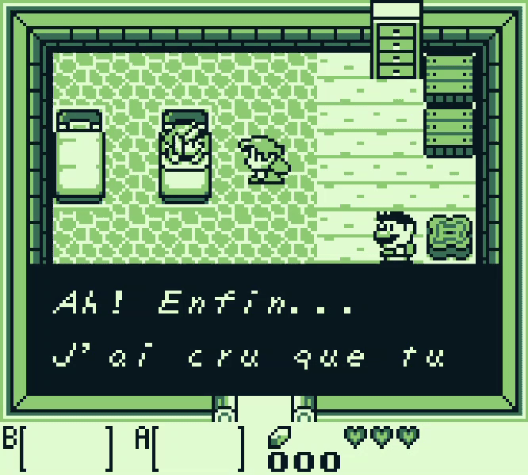

# 🕹️ WindGB - GameBoy Emulator

<p align="center">
    
</p>

WindGB is a **GameBoy** emulator written in C++. I wrote it to be as most cycle accurate as possible.
This project is a personal playground to explore emulators. It is not production-ready, but reflects my interest in low-level development and video games.
To run it, type the following command:
```bash
./windgb <path-of-rom>
```

## 🛠️ Build from source

### ❗ Requirements
- Compiler compatible with C++20
- CMake
- Git

### 📦 Installation

1. Clone the project:

   ```bash
   git clone https://github.com/RomainPlmg/WindGB.git
   cd WindGB
   ```

2. Create a build directory and generate the build files:
    ```bash
    mkdir build
    cd build
    cmake ..
    ```
3. Build the project
    ```bash
    make
    ```
4. Run the emulator
    ```bash
    ./emuapp <rom_file>
    ```

## ⚖️ Credits

This project uses the following libraries and resources:

- [SFML](https://github.com/SFML/SFML) – zlib/libpng license
- [spdlog](https://github.com/gabime/spdlog) – MIT license
- [argparse](https://github.com/p-ranav/argparse) – MIT license
- [Boot ROM Bootix](https://github.com/Hacktix/Bootix) – Creative Commons Zero v1.0 Universal license
- [Blargg's test suite](https://github.com/retrio/gb-test-roms) – From [retr.io](https://github.com/retrio), many thanks for the GP test ROMs
- [DMG-acid2](https://github.com/mattcurrie/dmg-acid2) – From [Matt Currie](https://github.com/mattcurrie), many thanks for the PPU test ROM
- [LLD-gbemu](https://github.com/rockytriton/LLD_gbemu) – From [Rockytriton](https://github.com/rockytriton), special thanks for his great tutorial ([YouTube series](https://www.youtube.com/watch?v=e87qKixKFME&list=PLVxiWMqQvhg_yk4qy2cSC3457wZJga_e5&ab_channel=LowLevelDevel))

## 📜 License
This project is licensed under the MIT License – see the [LICENSE](LICENSE) file for details.