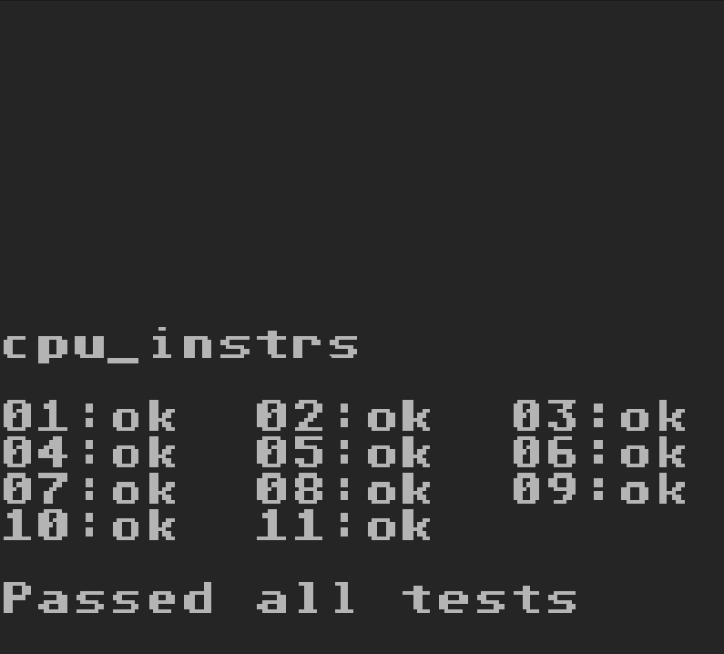

<p align="center">
  
</p>

# 🕹️ WindGB - GameBoy Emulator

WindGB is a **GameBoy** emulator written in C++. It is designed to be performant and accurate in executing the GameBoy's instructions. This project uses **Blargg’s tests** to ensure compatibility and correctness of the emulator.

## 🌟 Features

- **GameBoy Instructions Emulation**: All GameBoy instructions are supported.
- **Compatibility Tests**: Utilizes Blargg’s tests to verify the proper functionality of the emulator.
<!-- - **Graphical Output**: Visual output for the GameBoy emulation. -->
<!-- - **Sound Management**: Simulates the GameBoy sound. -->

## 🛠️ Build from source

### ❗ Requirements
- C++17
- CMake
- Git

### 📦 Installation

1. Clone the project:

   ```bash
   git clone https://github.com/RomainPlmg/WindGB.git
   cd WindGB
   ```

2. Create a build directory and generate the build files:
    ```bash
    mkdir build
    cd build
    cmake ..
    ```
3. Build the project
    ```bash
    make
    ```
4. Run the emulator
    ```bash
    ./emuapp <rom_file>
    ```

## 🧪 Blargg's Tests

Blargg’s Game Boy Test Suite is a collection of tests used to validate the accuracy of the GameBoy emulation ([🔗Link](https://github.com/retrio/gb-test-roms.git)). Below is a table of the tests executed and their results for WindGB.

### CPU Instructions ✅
| Test                               | Result   | Remarks |
| ---------------------------------- | -------- | ------- |
| **Test 1: Special**                | ✅ Passed |         |
| **Test 2: Interrupts**             | ✅ Passed |         |
| **Test 3: Op SP, HL**              | ✅ Passed |         |
| **Test 4: Op R, imm**              | ✅ Passed |         |
| **Test 5: Op RP**                  | ✅ Passed |         |
| **Test 6: LD R, R**                | ✅ Passed |         |
| **Test 7: JR, JP, CALL, RET, RST** | ✅ Passed |         |
| **Test 8: Misc Instructions**      | ✅ Passed |         |
| **Test 9: Op R, R**                | ✅ Passed |         |
| **Test 10: Bit Operations**        | ✅ Passed |         |
| **Test 11: Op A, \[HL\]**          | ✅ Passed |         |

